<div align="center">


<br>


</div>

---

# 👋 Hi, I'm Yazdan Haider

### Full-Stack Web Developer | PHP & Laravel Specialist

I'm a **Full-Stack Web Developer with 10+ years of experience** building websites, web applications, APIs, SaaS platforms, eCommerce solutions, and business management systems.

My primary expertise is **PHP & Laravel**, combined with MySQL, JavaScript, Vue.js, Nuxt, WordPress, OpenCart, Linux servers and modern AI-assisted development workflows.

---

## 🚀 About Me

```text
💻 10+ Years of Web Development
🔥 PHP & Laravel Specialist
🌐 Full-Stack Web Applications
⚡ REST APIs & SaaS Platforms
🗄️ MySQL & Database Optimization
🎨 Vue.js / Nuxt
🛒 WordPress / OpenCart
☁️ Linux / cPanel / WHM
🤖 AI-Assisted Development
🇩🇪 German A1 — Currently Learning
```

---

## 🛠️ Tech Stack

### Backend

<p>

</p>

### Frontend

<p>

</p>

### Database

<p>

</p>

### CMS & eCommerce

<p>

</p>

### DevOps & Tools

<p>

</p>

---

## 💼 What I Build

<table>
<tr>
<td width="50%" align="center">

### 🚀 SaaS Applications

Laravel-based SaaS platforms, dashboards, authentication systems, APIs and business applications.

</td>

<td width="50%" align="center">

### 🧾 Business Systems

POS, inventory, sales, customer management, reporting and business automation systems.

</td>
</tr>

<tr>
<td align="center">

### 🔌 REST APIs

Backend APIs, third-party integrations and services for web applications.

</td>

<td align="center">

### 🛒 eCommerce

Custom eCommerce solutions using Laravel, WordPress and OpenCart.

</td>
</tr>

<tr>
<td align="center">

### 🌐 Websites

Business websites, custom CMS solutions and high-performance web applications.

</td>

<td align="center">

### ☁️ Infrastructure

Linux servers, cPanel/WHM, DNS, hosting, migrations and website infrastructure.

</td>
</tr>
</table>

---

## 🧠 My Development Approach

```php
<?php

class Developer
{
    public string $focus = "Building practical software";

    public array $principles = [
        "Clean & maintainable code",
        "Performance matters",
        "Security first",
        "Simple solutions",
        "Continuous learning",
        "Business requirements first",
    ];

    public function build(): string
    {
        return "Think → Build → Test → Improve → Ship 🚀";
    }
}
```

---

## 🤖 AI & Modern Development

I'm actively integrating **AI into my software development workflow** to improve productivity and development quality.

```text
🤖 AI-Assisted Coding
        ↓
🧠 Code Generation & Refactoring
        ↓
🐛 Debugging & Problem Solving
        ↓
🔌 API Development
        ↓
📝 Documentation
        ↓
⚙️ Development Automation
        ↓
🚀 AI-Powered Applications
```

---

## 📊 GitHub Statistics

<div align="center">




</div>

<br>

<div align="center">


</div>

---

## 🐍 Contribution Activity

<div align="center">

<picture>
  <source media="(prefers-color-scheme: dark)" srcset="https://raw.githubusercontent.com/YazdanHaider27/YazdanHaider27/output/github-snake-dark.svg">
  <source media="(prefers-color-scheme: light)" srcset="https://raw.githubusercontent.com/YazdanHaider27/YazdanHaider27/output/github-snake.svg">
  
</picture>

</div>

---

## 🚀 Featured Work

### 🧾 Business & POS Systems

Building practical business management solutions including:

`Sales` `Inventory` `Customers` `Payments` `Reports` `Users & Roles`

### 🌐 Laravel Applications

Developing custom applications using:

`PHP` `Laravel` `MySQL` `REST APIs` `Vue.js`

### 🛒 eCommerce

Experience with:

`WordPress` `WooCommerce` `OpenCart` `Custom PHP`

---

## 📈 Currently Learning & Improving

```text
Laravel
   │
   ▼
REST APIs
   │
   ▼
Vue 3
   │
   ▼
Nuxt
   │
   ▼
Advanced Full-Stack Development
   │
   ▼
AI-Powered Development 🤖
```

---

## 🌍 Languages

| Language | Level |
|---|---|
| 🇬🇧 English | Professional |
| 🇵🇰 Urdu | Native |
| 🇩🇪 German | A1 — Learning |

---

## 📫 Connect With Me

<div align="center">

<a href="https://github.com/YazdanHaider27">

</a>

<a href="https://softlico.com">

</a>

</div>

---

<div align="center">

### 💬 Let's Build Something Great

**PHP • Laravel • Full-Stack Development • SaaS • APIs • AI**

<br>


</div>
